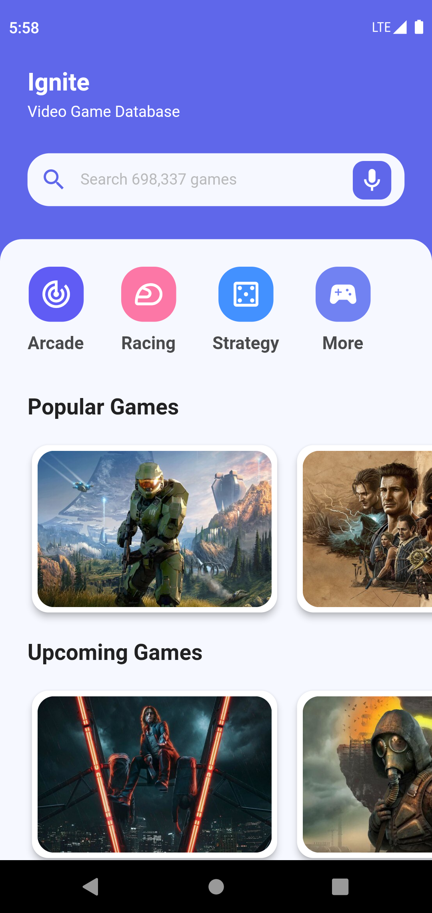
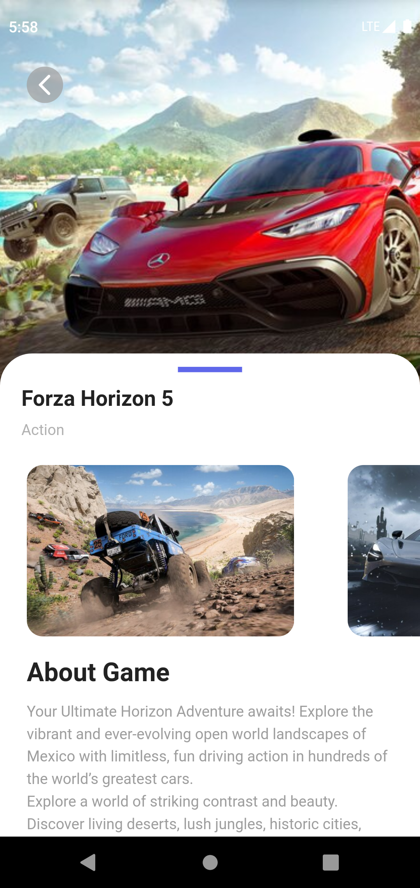
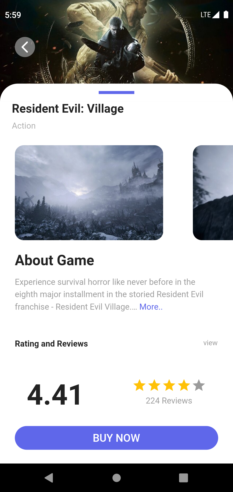

# Ignite Flutter
A video game database App build using flutter and dart.

## **Dependencies**

- [Http](https://pub.dev/packages/http)
- [Readmore](https://pub.dev/packages/readmore)
- [GetX](https://pub.dev/packages/get)

## Screenshots

---

## To-do List:

- [ ] Favorite Game
- [ ] Buy Now Support
- [ ] Video Support
- [ ] Animation
- [ ] Theming

## Document

[API](https://github.com/BikashKalita/game-api)

## ✍️ Author

- [**Bikash Kalita**](https://github.com/BikashKalita) - _Author_

---

## 📜 License

This project is licensed under [MIT License](https://opensource.org/licenses/MIT) - see the [LICENSE](LICENSE) file for details.

---
